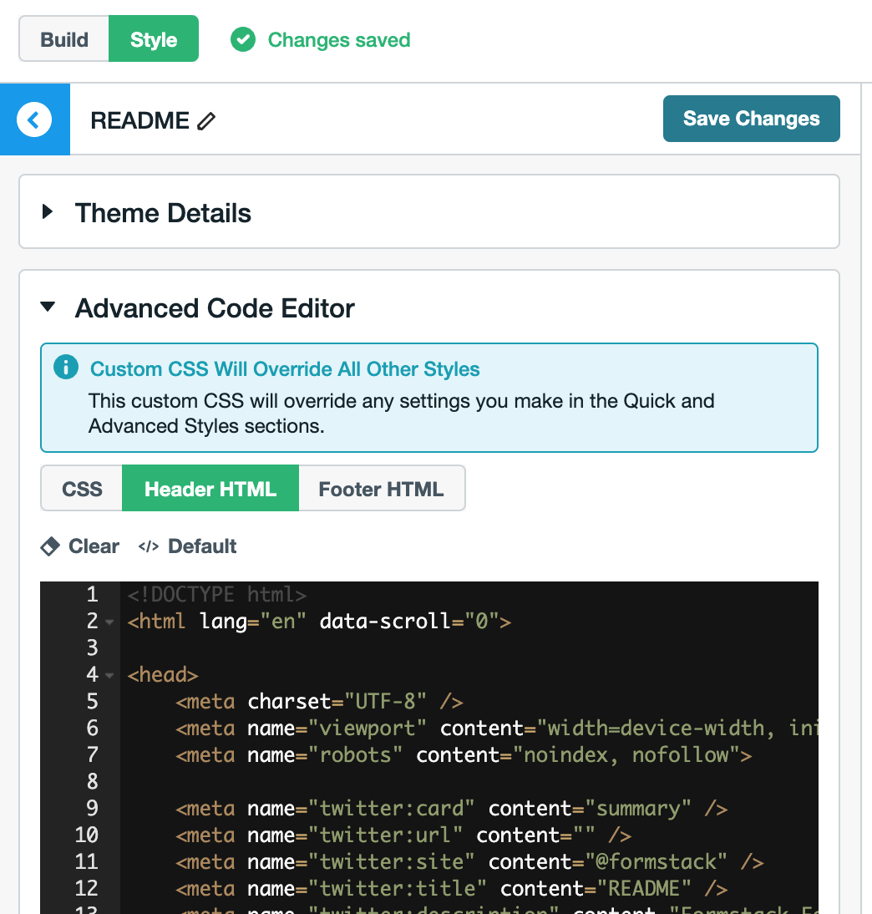
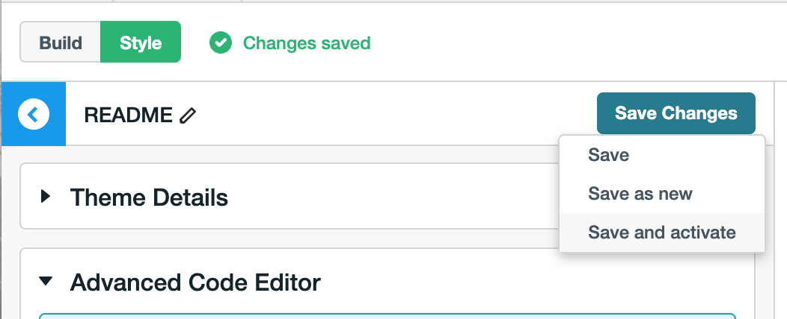
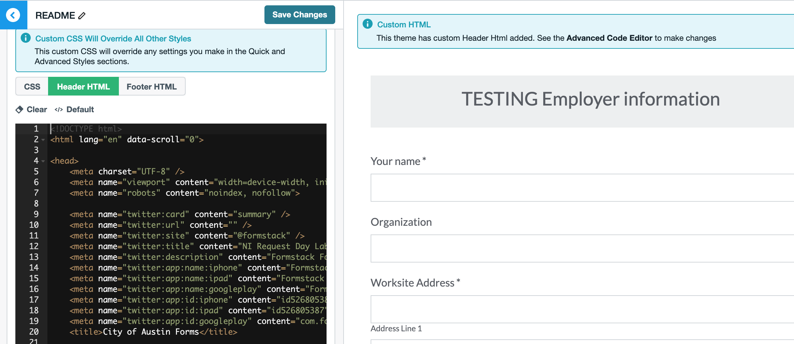

# formstack-alpha-theme
Custom Formstack theme for forms embedded on alpha.austin.gov

## Why?
Our Formstack custom theme requirements extend beyond basic styling tweaks. We inject custom html, js, and css that we need to manage in an organized way. This repo uses the Handlebars templating engine to generate Formstack-compatible Header and Footer HTML to use on forms embedded on the City of Austin website.

Using git version control on our Formstack theme allows us to protect our styles against accidental deletion and breaking changes. We can easily revert to working versions and track who added changes and why.

We also gain the benefit of using our own developer IDEs and external libraries to construct our Formstack theme. This can help improve the readability of our theme. By using Handlebars templating we can easily deduce which custom pieces of code we're adding to our template. If the Formstack API ever changes, we'll know which pieces we need to port over.

## Where?

After you have edited and built your theme (see How? below), the generated Header and Footer HTML files are located in the [theme](theme) directory.

If you want to use them:
1. Copy and paste [theme/footer.html](theme/footer.html) into the "Footer HTML" section of the "Advanced Code Editor" in your Theme Editor on Formstack.
2. Copy and paste [theme/header.html](theme/header.html) into the "Header HTML" section of the "Advanced Code Editor" in you Theme Editor on Formstack.
  - 

3. Enable your changes by entering "Save and activate" under "Save Changes". "Save and activate" will apply the theme to whatever form you are viewing on Formstack.
  - 

#### Important Note: Both the custom Header and Footer overrides are required.
Without the custom Footer HTML, the body of the form will not display due to custom logic in the Header HTML styles (see [/src/partials/js/renderBody.js](/src/partials/js/renderBody.js)).

This is because we added `display: none` to our body within our Header styles. This prevents the user from seeking weird flickering and text moving around as our custom styles and js get applied.

## How?

### To Build

1. Install node and yarn.
2. Run `yarn install` to install dependencies.
3. Run `yarn build` to rebuild `/theme/header.html` and `/theme/footer.html`.

The build command runs `/build/render.js`. This compiles our Handlebars `/src/footer.hbs` and `/src/header.hbs` templates into static HTML.

Add extra Handlebar Partials to the `src/partials` directory. The base filename (use underscore_deliminated_names for compatibilty with the "Handlebar" and "hbs" libraries' parsers) will be the name of the Partial you can use in the `*.hbs` files.

For clarity, please add a `<!-- COA Import ... -->` comment above any new Partial that you import into the Header template.

### To Preview

1. Install node and yarn.
2. Run `yarn install` to install dependencies.
3. Run `yarn preview` to serve a live reloading preview to http://localhost:5000.

This will allow you to see how your styles render on a real form.

#### Submitting on Preview

Pressing "Submit" will create a new submission in Formstack. This is perfectly ok to do with the demo forms included in this repo. But it's something to be mindful of if you decide to use a different form.

#### Confirmation Page on Preview

Themes only get applied to the Confirmation Page when they are “Saved and activated”. So the Confirmation Page you get when using the local `yarn preview` won’t use your local template, it will pull its styling directly from Formstack. You’ll have to “Save and activate” your custom Header and Footer HTML on Formstack in order to see style changes to the Confirmation Page.

#### To Preview your own form

If you want to plug in a different form to use, you'll have to manually retrieve it from Formstack's API using `/build/getDemoFormBody.js`. Copy `template.env` into a `.env` file, plug in your Formstack credentials, and run `node build/getDemoFormBody.js`. Plug in your own DEMO_FORM_BODY_PARTIAL .env variable to use it in Preview.
- If you get the `You do not have high enough permissions for this form` error when attempting to build your form, check to see if your form is in the *Office of Design and Delivery* folder on formstack, as permissions in other folders may draw this error.

## Wait, what?

There are some gotchas to watch out for. When you edit Formstack themes using the GUI or the "CSS" tab in the "Advanced Code Editor", the Formstack theme will render exactly as expected. However, when editing Header HTML code directly (as we're doing), there are some non-obvious bugs to watch out for.

### css within \<style\> tags must NOT be indented in order to be compiled by Formstack.
Only this works:
```
<head>
    <style type="text/css">
/* Default styles */
body {
    background-color: #ffffff;
}
    </style>
    <style type="text/css">
/* Override styles */
body {
    background-color: #ffffff;
}
    </style>
</head>
```
Despite being valid html, the following will not work:
```
<head>
    <style type="text/css">
        /* Default styles */
        body {
            background-color: #ffffff;
        }
    </style>
    <style type="text/css">
        /* Override styles */
        body {
            background-color: #ffffff;
        }
    </style>
</head>
```


If the content with a \<style\> tag is indented, then the formstack compiler will break. Not only will your styles not render, the entire form will not render.

That's why our template does not indent handlebar partials within the \<style\> tag:
```
  <head>
    <style type="text/css">
{{> overrideStyles }}
    </style>
  </head>
```

An aside for Formstack developers: if there's only one css style tag, then having the css aligned with the script tag will work:
```
<head>
  <style type="text/css">
  body {
      background-color: #ffffff;
  }
  </style>
</head>
```
But once there are two \<style\> tags, the css for both must be all the way left aligned.

### There is an undocumented size limit to the Header HTML
And if you surpass it, the css stylesheets will load incompletely. If you surpass the size limit a little bit more, your form will not render at all.

To circumvent this issue, we compress the css that we add with node-sass-chokidor.

### Formstack's Preview won't work
When editing themes using the GUI or the "CSS" tab in the "Advanced Code Editor," your changes will instantly be rendered in the Preview window on the righthand side.

However, changes made in the "Header HTML" tab don't register in the Preview.


Don't worry. Your changes will work on the Live site once you "Save and activate." You can check by going to "View Site Live." You can also run `yarn preview` to see how your styles look on our demo form.
